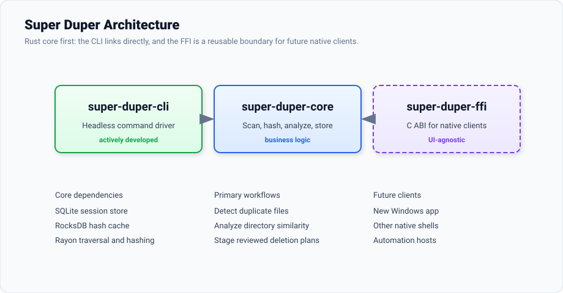

# Super Duper

A high-performance duplicate file detector written in Rust. Super Duper scans large file
collections, confirms duplicates by content rather than filename, identifies near-duplicate
directory trees, and stages reviewed deletion plans locally.

The repository is now intentionally focused on the Rust engine, CLI, reusable FFI boundary, and
docs. No Windows app implementation is present on this branch, so a new Windows app can be designed
from a clean slate.

## Features

- Two-tier hashing: exact file size, then a 1 KB XxHash64 partial hash, then full-content hashing
  only for candidates
- Persistent RocksDB hash cache keyed by canonical path and sub-second modified timestamp
- SQLite session storage for scans, duplicate groups, directory analysis, and deletion plans
- Directory fingerprinting and Jaccard similarity for exact, subset, and near-match folder trees
- Reviewed deletion workflow: files are staged before execution
- Headless CLI for repeatable scans, scripting, and verification
- C-compatible FFI crate for future native clients

## Architecture

Super Duper is a Cargo workspace. The Rust core library owns the product logic; the CLI links it
directly, and the FFI crate exposes a stable boundary for future native interfaces.

```text
super-duper/
  Cargo.toml
  Cargo.lock
  Config.toml
  crates/
    super-duper-core/     # scanning, hashing, analysis, storage, deletion plans
    super-duper-cli/      # headless command-line driver
    super-duper-ffi/      # C ABI for future native apps
  docs/
    architecture.svg
```



## Getting Started

### Prerequisites

| Tool | Notes |
|---|---|
| Rust toolchain | `rustup` recommended, stable channel |
| `libclang-dev` | Required by RocksDB's bindgen step on Linux |

### Build

```bash
cargo build --workspace
cargo build --release --workspace
```

### Configure Scan Targets

Edit `Config.toml`:

```toml
root_paths = [
    "C:/Users/you/Documents",
    "D:/Archive",
]

ignore_patterns = [
    "**/node_modules/**",
    "**/.git/**",
    "*/$RECYCLE.BIN",
]
```

### Run The CLI

```bash
# Full duplicate detection pipeline
cargo run -p super-duper-cli -- process

# Re-run directory fingerprinting and similarity analysis
cargo run -p super-duper-cli -- analyze-directories

# Inspect the persistent hash cache
cargo run -p super-duper-cli -- count-hash-cache

# Print loaded configuration
cargo run -p super-duper-cli -- print-config

# Wipe all SQLite tables with confirmation
cargo run -p super-duper-cli -- truncate-db
```

## Environment Variables

Configured via a `.env` file in the working directory when needed.

| Variable | Default | Description |
|---|---|---|
| `TRACING_LEVEL` | `info` | Log verbosity: `trace`, `debug`, `info`, `warn`, `error` |
| `LOG_FILE_PATH` | `./logs/sd.log` | File log output path |
| `HASH_CACHE_PATH` | `content_hash_cache.db` | RocksDB hash cache location |

## Database

Super Duper uses embedded SQLite (`super_duper.db` in the working directory). The schema is applied
automatically on first run.

Key tables:

| Table | Purpose |
|---|---|
| `scan_session` | One row per scan run |
| `scanned_file` | Global file index with metadata and hashes |
| `duplicate_group` | Confirmed duplicate sets for a session |
| `duplicate_group_member` | Duplicate group membership |
| `directory_node` | Directory tree aggregates |
| `directory_fingerprint` | Per-directory content fingerprints |
| `directory_similarity` | Precomputed Jaccard pairs |
| `deletion_plan` | Files staged for deletion |

## FFI Boundary

The `super-duper-ffi` crate exposes the core through a C ABI for future native clients.

- Handle-based API with opaque `u64` handles
- Rust-owned buffers paired with explicit `sd_free_*()` functions
- Thread-local error messages via `sd_last_error_message()`
- Paginated list queries for large result sets
- Progress callbacks for long-running scans

## Project Status

The Rust core and CLI are functional. This branch deliberately removes the previous Windows app
implementation so the next Windows app can be rebuilt without inheriting its structure, UI choices,
or workarounds.
