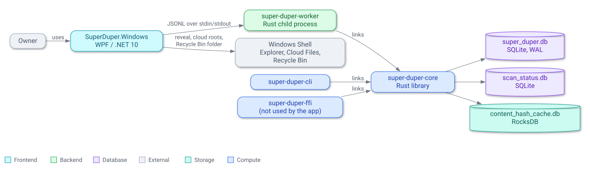

# Super Duper

A high-performance duplicate file detector written in Rust with a Windows front end. Super Duper
scans large file collections, confirms duplicates by content rather than filename, finds exact
duplicate folders, and lets you review what to keep.

The Windows app is **review-only**: it records keep/remove decisions but never deletes, moves, or
modifies scanned files. The repository contains the Rust engine, a CLI, a reusable FFI boundary,
the versioned worker process, and the Windows 11 x64 WPF app.

## Use The Windows App

Download `super-duper-<version>-win-x64.zip` from the
[latest release](https://github.com/garygentry/super-duper/releases), unzip it anywhere, and run
`SuperDuper.Windows.exe`. It needs Windows 11 x64 and no separate .NET runtime or installer. The
build is not code-signed, so SmartScreen may warn on first launch.

New to Super Duper? Start with [Find your first duplicates](docs/user-guide/getting-started.md).
The [documentation index](docs/README.md) lists the full user guide, the architecture notes, and the
build, test and release guides.

## Features

- Staged hashing: exact file size, then a 1 KB XxHash64 partial hash, then full-content hashing only
  for remaining candidates
- Streaming full-file hashing with a bounded buffer and one RocksDB repeat cache, keyed by a content
  signature (canonical path, size, and high-resolution modified timestamp) and shared by hashing and
  exact-folder verification
- SQLite storage for saved scans, immutable runs, duplicate groups, directory analysis, and review
  decisions
- Exact duplicate-folder verification by relative structure and content, with redundant nested
  matches suppressed; directory fingerprinting and Jaccard similarity for near-match folder trees
- Cloud-safe scanning: registered cloud sync folders (OneDrive and others) are excluded before any
  content is read, and scans refuse to start when detection is unavailable
- Windows 11 app with saved scans, cancellable progress, paged duplicate-file and duplicate-folder
  browsing, durable non-deleting review decisions, preferred-location rules, and Explorer reveal
- Headless CLI for repeatable scans, scripting, and verification
- C-compatible FFI crate for future native clients (the CLI and FFI keep a legacy deletion-plan
  model; the Windows app does not use it)

## Architecture

Super Duper is a Cargo workspace. The Rust core library owns the product logic; the CLI links it
directly, the FFI crate exposes a stable boundary for future native interfaces, and the Windows app
connects to the Rust engine through a long-lived JSONL worker process that alone owns the app's
databases. See the [system overview](docs/architecture/overview.md) for the containers and stores.

<picture>
  <source media="(prefers-color-scheme: dark)" srcset="docs/architecture/images/arch-overview.dark.svg" />
  <source media="(prefers-color-scheme: light)" srcset="docs/architecture/images/arch-overview.light.svg" />
  
</picture>

```text
super-duper/
  Cargo.toml
  Cargo.lock
  Config.toml
  crates/
    super-duper-core/     # scanning, hashing, analysis, storage, deletion plans
    super-duper-cli/      # headless command-line driver
    super-duper-ffi/      # C ABI for future native apps
    super-duper-worker/   # JSONL process boundary for the Windows app
  apps/
    windows/              # WPF/.NET 10 solution, application layers, and tests
  scripts/                # smoke, UI-dev launch, release verification, notices
  docs/
    README.md             # documentation index
    user-guide/           # using the Windows app
    architecture/         # system overview, Windows app structure, decisions
    windows-*.md          # build, UI dev sessions, testing, smoke, recovery
    worker-protocol-v1.md # worker protocol and other contracts, schema notes
```

## Build From Source

### Prerequisites

| Tool           | Notes                                                                        |
| -------------- | ---------------------------------------------------------------------------- |
| Rust toolchain | `rustup` recommended, stable channel, 1.98 or newer                          |
| `libclang-dev` | Required by RocksDB's bindgen step on Linux                                  |
| .NET SDK       | 10.0.400 or a compatible 10.0 patch; required for the Windows app            |
| Windows        | Windows 11 x64 for building and running the WPF application                  |
| Windows SDK    | A Windows 11 SDK capable of targeting `10.0.22000.0`                         |
| VS build tools | C++ x64 build tools and Clang (`LIBCLANG_PATH`) for RocksDB on Windows       |
| PowerShell 7   | `pwsh` for the `scripts/*.ps1` workflows                                     |
| `cargo-about`  | Only for release verification (third-party notices)                          |

[`docs/windows-build.md`](docs/windows-build.md) has the exact Visual Studio components and setup.

### Build The Windows Application

Open PowerShell in the repository root (the directory containing `Cargo.toml`) and build Rust
before .NET. The WPF project copies the worker for the selected configuration beside the Windows executable.

```powershell
# Debug engine, worker, Windows application, and tests
cargo build --workspace
cargo test --workspace
dotnet build apps/windows/SuperDuper.Windows.sln
dotnet test apps/windows/SuperDuper.Windows.sln -m:1

# Release engine, worker, Windows application, and tests
cargo build --workspace --release
dotnet build apps/windows/SuperDuper.Windows.sln --configuration Release
dotnet test apps/windows/SuperDuper.Windows.sln --configuration Release -m:1
```

Run the .NET test projects serially (`-m:1`): the WPF smoke tests start real windows on an STA
thread and can time out when they run alongside the worker-backed integration tests.

The Debug build copies `target/debug/super-duper-worker.exe` beside the app; the Release build
copies `target/release/super-duper-worker.exe`. The copy is skipped silently when the worker has not
been built, so build Rust first: a Debug app otherwise runs whatever worker is already beside it
(possibly stale) or falls back to `target/debug`, and a Release app fails to start its worker.

### Test

```bash
cargo test --workspace
cargo test --workspace --release
dotnet test apps/windows/SuperDuper.Windows.sln -m:1
dotnet test apps/windows/SuperDuper.Windows.sln --configuration Release -m:1
```

### Run A Debug Build

From the repository root:

```powershell
cargo build -p super-duper-worker
dotnet run --project apps/windows/src/SuperDuper.Windows/SuperDuper.Windows.csproj
```

`dotnet run` builds and starts the Debug WPF application. Keep the terminal open while developing;
closing the WPF window shuts down its privately owned worker.

After `dotnet build`, the Debug executable can also be started directly:

```powershell
$debug = Resolve-Path 'apps/windows/src/SuperDuper.Windows/bin/Debug/net10.0-windows10.0.22000.0/win-x64'
Start-Process -FilePath (Join-Path $debug 'SuperDuper.Windows.exe') -WorkingDirectory $debug
```

### Build And Run The Verified Release

Run the release verifier on an interactive Windows 11 x64 desktop. Do not use `-SkipWpfSmoke` for
a release candidate.

```powershell
./scripts/Verify-WindowsRelease.ps1
```

The verifier runs the Rust and .NET Release tests and creates a self-contained `win-x64` publish
in `artifacts/windows-x64`. It checks that the Cargo and .NET versions agree, adds `LICENSE.txt`,
`THIRD-PARTY-NOTICES.txt` (generated with `cargo-about`) and `CHANGELOG.md`, runs the worker
protocol smoke (against `target/release`) and the WPF smoke against the published app, and packages
`artifacts/super-duper-<version>-win-x64.zip` with a `.sha256` file. The zip needs no installed
.NET runtime. See [`docs/release-checklist.md`](docs/release-checklist.md) for the full release
procedure and which gates run in CI versus on the Windows VM.

To start the published application:

```powershell
$publish = Resolve-Path 'artifacts/windows-x64'
Start-Process -FilePath (Join-Path $publish 'SuperDuper.Windows.exe') -WorkingDirectory $publish
```

The release build is not code-signed, so Windows SmartScreen may warn on first launch.

### Runtime State And Overrides

The app keeps `super_duper.db`, `scan_status.db`, `content_hash_cache.db` and its preferences in
`%LOCALAPPDATA%\SuperDuper`, which it creates on first start. When `SUPER_DUPER_DB_PATH` is set,
the other state follows that database's folder unless overridden individually. The worker run on
its own (for example by tests) defaults to its working directory. The app looks for
`super-duper-worker.exe` beside its executable and then in the repository's `target/debug`
directory in Debug builds. Release builds use only the worker beside the app.

These optional environment variables override those locations:

- `SUPER_DUPER_WORKER_PATH`: absolute path to `super-duper-worker.exe` (Debug builds only)
- `SUPER_DUPER_DB_PATH`: absolute path to the worker-owned SQLite database
- `SUPER_DUPER_STATUS_DB_PATH`: absolute path to the scan-telemetry status database
- `HASH_CACHE_PATH`: path to the RocksDB content-hash cache directory

Super Duper runs one window per data folder: starting it again brings the existing window forward.

PowerShell environment variables are inherited by applications started from that terminal. Clear
old overrides before a normal launch if they refer to deleted disposable state:

```powershell
Remove-Item Env:SUPER_DUPER_WORKER_PATH -ErrorAction SilentlyContinue
Remove-Item Env:SUPER_DUPER_DB_PATH -ErrorAction SilentlyContinue
Remove-Item Env:SUPER_DUPER_STATUS_DB_PATH -ErrorAction SilentlyContinue
Remove-Item Env:HASH_CACHE_PATH -ErrorAction SilentlyContinue
```

For an isolated disposable run, pass explicit state only to the new process:

```powershell
$publish = (Resolve-Path 'artifacts/windows-x64').Path
$state = Join-Path ([IO.Path]::GetTempPath()) ('super-duper-' + [guid]::NewGuid().ToString('N'))
New-Item -ItemType Directory -Path $state | Out-Null

$start = [Diagnostics.ProcessStartInfo]::new()
$start.FileName = Join-Path $publish 'SuperDuper.Windows.exe'
$start.WorkingDirectory = $publish
$start.UseShellExecute = $false
$start.Environment['SUPER_DUPER_DB_PATH'] = Join-Path $state 'super_duper.db'
$start.Environment['HASH_CACHE_PATH'] = Join-Path $state 'hash-cache'
$start.Environment.Remove('SUPER_DUPER_WORKER_PATH')
[Diagnostics.Process]::Start($start)
```

Do not point these overrides at real user data when running smoke or fault-injection workflows.

Run `./scripts/Invoke-WindowsSmoke.ps1` for the repeatable worker/WPF smoke fixture. See
[`docs/windows-smoke.md`](docs/windows-smoke.md) and
[`docs/windows-recovery.md`](docs/windows-recovery.md) for diagnostics, limitations, and recovery.

### Configure Scan Targets

Edit `Config.toml`:

```toml
root_paths = [
    "C:/Users/you/Documents",
    "D:/Archive",
]

ignore_patterns = [
    "**/node_modules/**",
    "**/.git/**",
    "*/$RECYCLE.BIN",
]

# Optional; both default to the values below and are validated on load.
# directory_similarity_threshold = 0.5      # minimum Jaccard similarity to report (0.0-1.0)
# directory_similarity_noise_cutoff = 50    # a hash in more directories than this is noise
```

### Run The CLI

```bash
# Full duplicate detection pipeline
cargo run -p super-duper-cli -- process

# Re-run directory fingerprinting and similarity analysis
cargo run -p super-duper-cli -- analyze-directories

# Count live entries in the persistent hash cache (read-only; safe while a scan is running)
cargo run -p super-duper-cli -- count-hash-cache

# Remove hash-cache entries not confirmed unchanged, or created, in the last 10 scans (default)
cargo run -p super-duper-cli -- trim-hash-cache

# Print loaded configuration
cargo run -p super-duper-cli -- print-config

# Mark duplicate-group non-survivors for deletion (keeps one file per group)
cargo run -p super-duper-cli -- auto-mark --strategy keep-newest

# Wipe all SQLite tables with confirmation
cargo run -p super-duper-cli -- truncate-db
```

## Environment Variables

The CLI reads these from the environment or a `.env` file in its working directory. The Windows
app and its worker read the `SUPER_DUPER_*` and `HASH_CACHE_PATH` variables from the environment.

| Variable                     | Default                                                       | Description                                              |
| ---------------------------- | ------------------------------------------------------------- | -------------------------------------------------------- |
| `TRACING_LEVEL`              | `info`                                                        | CLI log verbosity: `trace`, `debug`, `info`, `warn`, `error` |
| `LOG_FILE_PATH`              | `./logs/sd.log`                                               | CLI file log output path                                 |
| `HASH_CACHE_PATH`            | App: beside the database; CLI: `content_hash_cache.db`        | RocksDB hash cache location                              |
| `SUPER_DUPER_DB_PATH`        | App: `%LOCALAPPDATA%\SuperDuper\super_duper.db`               | Worker-owned SQLite database                             |
| `SUPER_DUPER_STATUS_DB_PATH` | Beside the database (`scan_status.db`)                        | Scan telemetry database                                  |
| `SUPER_DUPER_LOG`            | `super_duper_core=info,super_duper_worker=info`               | Worker stderr tracing filter                             |
| `SUPER_DUPER_WORKER_PATH`    | Auto-detected                                                 | Worker executable override (Debug builds only)           |

## Database

Super Duper uses embedded SQLite: the app keeps `super_duper.db` in `%LOCALAPPDATA%\SuperDuper`,
and the CLI uses its working directory. New databases use schema version 15. Version 2 through 14 databases are upgraded transactionally and in place;
unknown older schemas and databases created by a newer engine are rejected without modification.
Each version has its own note, from [`docs/storage-schema-v3.md`](docs/storage-schema-v3.md) to
[`docs/storage-schema-v15.md`](docs/storage-schema-v15.md); see
[`docs/storage-schema-v6.md`](docs/storage-schema-v6.md) for durable file/folder-review storage and
[`docs/storage-schema-v4.md`](docs/storage-schema-v4.md) for cloud-safe run policy.

Scan telemetry lives in a separate worker-owned status database (`scan_status.db`), not in this
schema; see [`docs/scan-status-database.md`](docs/scan-status-database.md).

The schema has 40 tables in these families
([`schema.sql`](crates/super-duper-core/src/storage/schema.sql) is authoritative):

| Family                  | Tables                                                                                  |
| ----------------------- | --------------------------------------------------------------------------------------- |
| Saved scans and runs    | `scan_session`, `scan_run`, `run_exclusion`, `run_warning_aggregate`                     |
| Scan results            | `scanned_file`, `duplicate_group[_member]`, `duplicate_folder_group[_member]`, `directory_node`, `directory_fingerprint`, `directory_similarity` |
| Review                  | `review_plan`, `review_decision`, `review_folder_decision`, `review_command`, `review_folder_command` |
| Location preferences    | `preference_rule`, `preference_rule_root`, `preference_rule_command`, `review_rule_application`, `review_rule_decision`, `review_rule_reversal_command` |
| Live validation         | `review_live_validation[_item]`, `review_live_root_state`, `review_live_root_overflow`, `review_live_root_reconciliation[_item]`, `review_live_file_state` |
| Whole-plan check        | `preflight`, `preflight_item`, `preflight_item_source`                                   |
| Recycle Bin foundation  | `recycle_operation`, `recycle_operation_batch`, `recycle_operation_item`, `recycle_operation_report`, `recycle_operation_recovery`, `recovery_review_observation` (execution is disabled in the app) |
| Legacy                  | `deletion_plan` (CLI/FFI deletion staging, unused by the Windows app)                    |

## FFI Boundary

The `super-duper-ffi` crate exposes the core through a C ABI for future native clients.

- Handle-based API with opaque `u64` handles
- Rust-owned buffers paired with explicit `sd_free_*()` functions
- Thread-local error messages via `sd_last_error_message()`
- Paginated list queries for large result sets
- Progress callbacks for long-running scans
- A blocking `sd_scan_start`, and a cancellable, non-blocking
  `sd_scan_start_async`/`sd_scan_observe`/`sd_scan_join` alternative that runs the scan on a
  background thread so `sd_scan_cancel` and every query stay usable while it runs

## Project Status

The first release, [v0.1.0](https://github.com/garygentry/super-duper/releases/tag/v0.1.0), was
published on 2026-09-19; open work is tracked in
[GitHub issues](https://github.com/garygentry/super-duper/issues). The Rust engine and CLI are
functional, and the Windows app is released. The app is review-only: it has no operation that
deletes or moves scanned files, and Recycle Bin execution is disabled in production builds.

Not yet verified for v0.1.0: Windows high contrast, Narrator/NVDA, and multi-monitor or 200% DPI
behavior. Earlier plans and acceptance evidence were removed after v0.1.0 and remain available at
the [`v0.1.0` tag](https://github.com/garygentry/super-duper/tree/v0.1.0).

## License

Super Duper is released under the [MIT License](LICENSE). Release packages include
`THIRD-PARTY-NOTICES.txt` for the .NET runtime, NuGet packages, Rust crates and native libraries
they contain.
