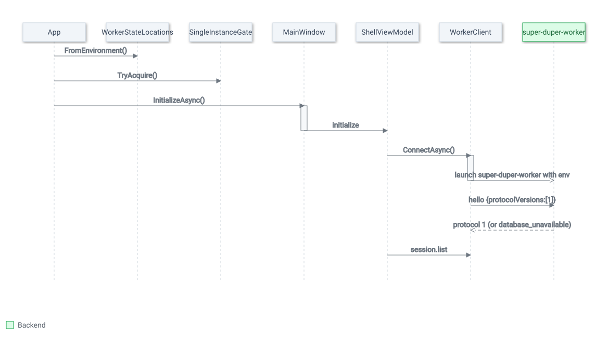

# Windows app runtime scenarios

## Purpose

This chapter walks through what actually executes when the Windows app starts, runs a scan, keeps
review results current, loses its worker, and shuts down. It is for maintainers changing lifecycle,
threading or protocol code. Structure is in [Windows app components](windows-app-components.md);
rules are in [Windows app conventions](windows-app-concepts.md).

<picture>
  <source media="(prefers-color-scheme: dark)" srcset="images/arch-runtime.dark.svg" />
  <source media="(prefers-color-scheme: light)" srcset="images/arch-runtime.light.svg" />
  
</picture>

The numbered steps below carry the same information as the diagram.

Paths are relative to `apps/windows/src/` unless they start with `crates/`.

## Startup

1. **Development sidecar (Debug only).** The `App` constructor
   (`SuperDuper.Windows/App.xaml.cs`) looks for `SuperDuper.Windows.uidev` beside the executable
   when `SUPER_DUPER_DB_PATH` is unset. The file must hold exactly two lines, a worker path that is
   the repository's `target\debug\super-duper-worker.exe` and a state folder under
   `artifacts\ui-dev-session\`; anything else throws. It sets the worker, database, status
   database and hash-cache variables for the process. Release builds compile this out.
2. **State locations.** `WorkerStateLocations.FromEnvironment()` resolves the database, status
   database, hash cache and state folder ([ADR-0005](decisions/0005-app-state-in-localappdata.md)).
3. **Single instance.** `SingleInstanceGate.TryAcquire` creates a named event derived from the
   state folder. If it already exists, this process signals it (the first window restores and
   activates itself) and `OnStartup` calls `Shutdown()` without showing a window.
4. **Container.** The DI container is built. `WorkerClient` is constructed but no process starts yet.
5. **Window.** `OnStartup` shows `MainWindow` and awaits `InitializeAsync`, which first restores
   presentation preferences (saved-scans pane, last results mode, expander states), then calls
   `ShellViewModel.InitializeAsync` with the window's lifetime token. The startup screen shows
   "Starting worker".
6. **Launch and handshake.** `WorkerClient.ConnectAsync` creates the default state folder if needed,
   starts the worker with the state paths in its environment, starts the stdout, stderr and exit
   pumps, and sends `hello` offering protocol 1. The whole handshake has 10 seconds.
7. **Worker opens its database.** The worker takes `<database>.lock`, waiting up to 3 seconds
   because Windows releases a dead process's lock asynchronously, then opens the database: it
   migrates the schema and marks runs left `running` or `cancelling` as `interrupted` (and does the
   same for unfinished whole-plan checks and recycle operations)
   (`crates/super-duper-worker/src/lib.rs`, `crates/super-duper-core/src/storage/sqlite.rs`).
8. **Database unavailable.** If the lock or open fails, the worker answers every request, `hello`
   included, with `database_unavailable` and a `reason` and `databasePath`, until stdin ends, then
   exits with code 1. The app raises `WorkerDatabaseUnavailableException`, whose `Describe()`
   supplies the title and guidance shown on the recovery card, and the state becomes Failed. Any
   other handshake failure shows "Worker connection failed" with the stderr tail.
9. **First load.** On success the state becomes Connected. `SessionListViewModel` pages
   `session.list` until it has every saved scan and selects the first. `SelectSessionAsync` then
   requests `session.get` and the first page of `run.list` together, loads Setup, and opens the
   newest run. If that run is still pending, running or cancelling, it becomes the active run and
   progress tracking begins. With no saved scans the empty state shows.

## Starting and following a scan

1. **Start.** The header button, labelled **Start scan** or **Scan again**, runs `StartRunCommand`
   in both cases. It is enabled only when connected, no run is active, history has loaded and Setup
   can start.
2. **Save first.** `StartRunAsync` locks Setup and calls `SessionSetupViewModel.EnsureSavedAsync`
   with a reachability requirement: it validates, re-runs cloud location detection (which must
   succeed), checks off the UI thread that at least one root exists, and creates or updates the
   saved scan if anything changed.
3. **Run.** It sends `run.start` with the chosen repeat-scan policy, marks the returned run active
   (Setup and the saved-scans list stay locked until it ends), selects it, moves to Scan › Progress,
   and then reads `run.get` so a lifecycle change that arrived before the response is not missed.
4. **Worker side.** The worker runs the scan on a background thread and emits `run.progress` and
   the `run.started`, `run.completed`, `run.cancelled` and `run.failed` events.
5. **Progress path.** Events arrive on the stdout pump thread. `WorkerRunProgressParser` validates
   each progress frame strictly; `ShellViewModel.OnRunProgress` validates it again against
   `WorkerProgressContract` and offers it to `LatestProgressApplicationGate`. The gate admits a
   frame only for the active run, in `running` or `cancelling`, with a strictly increasing sequence
   and source revision and no cumulative counter going backwards, and never `running` after
   `cancelling`. It keeps only the newest admitted frame and applies it at most once every
   100 ms: a delay, then one post to the UI dispatcher, with at most one post outstanding.
6. **Lifecycle path.** Lifecycle events update the gate on the pump thread (begin, cancelling,
   terminal) and then post the run update to the UI thread.
7. **Clocks.** While a run is active, `ScanProgressViewModel` ticks a one-second timer for elapsed
   time and freshness, and throttles screen-reader progress announcements to one every 5 seconds.
8. **Cancel.** **Cancel scan** sends `run.cancel` and marks the gate cancelling; no confirmation.
9. **Completion.** A terminal lifecycle event unlocks Setup and the saved-scans list, updates
   history, and raises the completion notice ("Scan complete · N duplicate file sets"). The app
   moves to Results by itself only when you were watching that run's Progress, no Setup departure
   is pending and no modal or owned window is open (`MainWindow.CanNavigateOnCompletion`);
   otherwise the notice offers **View results**.

## Live review state

Scan results are historical. The app keeps a separate, bounded view of whether reviewed files still
match, without ever changing the original results.

1. **Observe.** When Results › Files loads for a completed run, `ShellViewModel.EnsurePaneAsync`
   calls `ObserveReviewLiveState(run)`; opening another run clears it. Only completed runs are
   watched.
2. **Watch.** `WorkerClient` creates one `FileSystemWatcher` per scan root, up to 64 roots,
   recursive, for names, writes, sizes and creation times, with a 16 KiB buffer. A root that does
   not exist is skipped; a watcher that cannot start, or reports an error such as a buffer
   overflow, turns into an overflow for that root.
3. **Batch.** `ReviewLiveHintBatcher` collects up to 200 distinct paths per root and up to 64
   pending roots. More paths than that turn the root's batch into an overflow; roots beyond 64 are
   dropped. Every 100 ms it sends one root's batch.
4. **Send.** A hint batch goes to `review_live_hint.batch`; if that fails, or the batch is an
   overflow, the client sends `review_live_root.overflow`, which the worker records as a durable
   dirty root. Hints are advisory, so batcher failures are swallowed.
5. **Notify.** The worker answers and also emits `result.state_changed` with kind `hints` (the run
   files the paths resolved to) or `overflow` (the dirty root). The client treats
   `executorEnabled: true` in that event as a protocol violation, drops events for any run other
   than the observed one, and posts the rest to `DuplicateFilesViewModel.ApplyLiveStateChanged`.
6. **Show.** Hinted copies on the visible page are marked validation pending and announced. A dirty
   root is listed with a reconciliation warning; the Files view also loads existing dirty roots
   when it opens a run. Nothing is re-validated automatically.
7. **Act.** **Check these copies** sends `review_live_validation.run` for up to 200 visible copies;
   missing or changed copies invalidate their decisions. **Reconcile next batch** sends
   `review_live_root.reconcile` for up to 200 files of a dirty root. Folders have no live
   validation.

## Worker exit and recovery

1. **Detect.** `WorkerClient.MonitorExitAsync` notices a worker exit that the client did not
   request. It clears the handshake, fails every pending request with a connection error that
   includes the stderr tail, and raises `UnexpectedExit` with the exit code, executable path and
   diagnostic log path. A protocol violation on stdout (malformed or oversized frame, unknown
   response ID, unreadable event) fails pending requests and kills the worker, which lands here too.
2. **Mark locally.** `ShellViewModel` resets the progress gate and, on the UI thread, enters
   RecoveryRequired ("Worker exited unexpectedly"). An active run is shown as interrupted in
   Progress and History and its saved scan as "Recovery required"; this is a local view, not a
   database write. Setup and the saved-scans list are locked and the active run is cleared.
3. **Stay stopped.** Further requests fail with "The previous worker connection ended. Restart is
   required." until the user reconnects.
4. **Reconnect.** **Reconnect** (`RestartWorkerCommand`, available in Failed and RecoveryRequired)
   calls `RestartAsync`: stop the old process, reset the connection lifetime and stderr tail, start
   a fresh worker and repeat the handshake.
5. **Reconcile.** The new worker's database open marks the abandoned run `interrupted` durably
   (step 7 of Startup). The shell reloads saved scans, reselects the previous one, reports "Worker
   recovered", and reloads its history, which now shows the durable state.
6. **Fail again.** A `database_unavailable` answer or another failure leaves the app in Failed with
   the described reason; **Reconnect** stays available.

Diagnostics for these cases, including the worker log location, are in
[Windows recovery](../windows-recovery.md).

## Shutdown

1. **Intercept.** `MainWindow.OnClosing` cancels the first close request and starts
   `ShutdownAsync`; later close requests are ignored while it runs.
2. **Confirm.** `ShellViewModel.ConfirmCancelAndExitAsync` asks "Cancel scan and exit?" when a scan
   is active, or "Cancel check and exit?" when a whole-plan check is running. Declining keeps
   the window open. Accepting sends `run.cancel` or `preflight.cancel`; a failure there is ignored
   because closing stdin also cancels.
3. **Stop the app side.** The window is disabled, the lifetime token is cancelled, and pending
   initialization is awaited.
4. **Stop the worker.** `WorkerClient.DisposeAsync` stops the root watchers, fails pending requests,
   closes stdin, waits 2 seconds for the worker to exit, and otherwise kills its process tree.
5. **Worker side.** On end of input the worker cancels an active scan or whole-plan check, waits
   for it to stop, releases its lock and exits. If that outlasts the 2-second grace, the kill
   leaves the run `running` or `cancelling` in the database and the next worker start marks it
   `interrupted`.
6. **Flush.** The last presentation-preferences write is awaited.
7. **Finish.** Any failure shows "Shutdown failed" and re-enables the window. Otherwise
   `Application.Current.Shutdown()` is queued at Normal dispatcher priority, not an idle priority
   that a busy dispatcher could starve (covered by the Smoke test
   `ShutdownCompletionIsNotQueuedAtStarvableIdlePriority`). `App.OnExit` disposes the container
   and the single-instance gate.

## Unhandled exceptions

The orderly shutdown above needs a working UI thread and an intact view model; a bug that escapes
every local `catch` has neither. `App`'s constructor subscribes three last-chance handlers before
anything else runs
([ADR-0006](decisions/0006-last-chance-exception-handling.md)):

1. **`DispatcherUnhandledException`.** Covers every `async void` view event handler and
   `App.OnStartup`: none of them use `ConfigureAwait(false)` or a detached `Task.Run`, so a
   continuation after `await` still resumes on the dispatcher and reaches here, the same as a
   synchronous throw. Marked handled so the default WPF crash path does not also run.
2. **`AppDomain.UnhandledException`.** Catches an exception on a thread pool or background thread
   that never returns to the dispatcher. The CLR usually terminates the process right after this
   handler returns regardless of what it does.
3. **`TaskScheduler.UnobservedTaskException`.** Not fatal: a `Task` whose exception nobody observed
   is logged and marked observed so it cannot also surface later through the finalizer thread.

The two fatal handlers converge on one path: log the exception (source and full text) through
`IWorkerClient.LogDiagnosticAsync`, stop the worker and dispose the single-instance gate the same
way `App.OnExit` does (not the full confirm-and-cancel `ShutdownAsync` flow, which needs a working
window), show a plain message box naming the log file, then `Environment.Exit(1)`. `WorkerClient`'s
own event dispatch (`DispatchEventAsync`) isolates a subscriber's exception the same way at a
smaller scope: it is logged through the same path and the pump keeps running, instead of failing
every pending request and killing the worker for a bug in one view model's handler.
`LogDiagnosticAsync` writes through the one `BoundedDiagnosticLog` the connection already owns for
its stderr relay, serialized internally, so a crash report can never land in the same file at the
same time as a relayed stderr line and corrupt either one.

## Related decisions

- [ADR-0001: The Windows app reaches the engine through a worker process](decisions/0001-worker-process-boundary.md)
- [ADR-0003: One worker owns a database, one window per data folder](decisions/0003-one-owner-per-database.md)
- [ADR-0005: App state lives in %LOCALAPPDATA%\SuperDuper](decisions/0005-app-state-in-localappdata.md)
- [ADR-0006: Last-chance exception handling logs, stops the worker, and exits](decisions/0006-last-chance-exception-handling.md)
