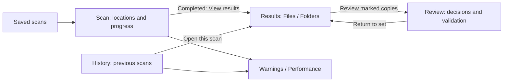

# Product direction and scope

## Intended experience

Super Duper is a desktop workspace for finding exact duplicates and making deliberate decisions
about copies across large drives. Optimize for repeated, often lengthy review by an owner who knows
their folders. First use should be approachable, but the main experience should remain efficient
for many results, deep paths, large drives, and long-running scans.

The primary questions are: What am I scanning? Which scan am I viewing? Where are the duplicates?
Which copies will I retain? What is marked for removal? What needs checking?

## Chosen approach

Keep WPF/.NET 10 Fluent and the long-lived Rust worker. Recompose navigation, screen layout, state
presentation, commands and copy. Use a persistent workspace with guided entry and review transitions.
Keep Results as the main working area after a completed scan; do not force a sequential wizard for
repeat work or unexpectedly navigate away when a background scan finishes.

Alternatives considered:

| Alternative | Assessment |
|---|---|
| Theme/spacing cleanup only | Insufficient for F01-F06; retains the same navigation and space allocation |
| Mandatory scan-to-delete wizard | Good first-run clarity, poor repeated comparison/history access; execution is currently disabled |
| Explorer clone with folder tree as the main result model | Familiar paths, but duplicate sets cross folders/drives; tree alone obscures relationships |
| Framework migration | No demonstrated need; introduces unrelated native/accessibility/lifecycle work |
| Persistent list/detail workspace with guided transitions | Recommended: preserves power, clarifies next actions and context |

## Information architecture

User-facing 'saved scan' means the reusable session definition. 'Scan' with a date means one run.
Technical IDs remain unchanged. A saved-scan selector can collapse at narrow widths; it is not a
second mandatory navigation rail. Four primary areas: Scan, Results, Review, History. Performance
and warnings open from explicit contextual links and retain an obvious return path.

## Release scope

In scope: all existing seven-tab capabilities remain reachable; clearer configuration and run
context; compact file/folder results; review plan overview using existing queries; discoverable
rule preview/application/reversal; non-deleting validation; contextual warnings/performance;
coherent loading/empty/stale/recovery states; keyboard, DPI, contrast and layout polish.

Out of scope: new similarity detection, automatic deletion, production Recycle Bin enablement,
pause/resume, simultaneous scans, automatic drive discovery, shell extension, content previews,
thumbnails, export, run-to-run content deltas, persistent saved-filter profiles, or a web frontend.
These are not quietly added because they would make an attractive mockup. Future proposals require
separate scope and appropriate safety review.

## Product invariants

1. Exactly one active scan globally. Browsing old results does not retarget cancellation.
2. One clearly identified selected historical run owns all displayed results and review decisions.
3. Scan findings are historical; current validity is separate. Missing status data is unavailable,
   not zero or a scan failure. Cancelled scans do not expose partial duplicate results.
4. Selecting a row never changes a decision. Marking for removal never executes deletion.
5. No UI can override survivor protection, hard-link identity, folder overlap, revision checks,
   or cloud exclusions. 'Undo' must not promise reversal of file deletion.
6. Counts and bytes use worker truth. Potential savings and marked-removal totals are distinct;
   folder/file overlap is not double-counted. Do not promise actual reclaimed space.
7. Changing filters never silently broadens a rule or bulk-action scope. No hidden select-all.
8. Server paging and existing collection/cache bounds survive the redesign. No full-run download
   for filtering, sorting, charts, or the Review screen.
9. No filesystem, database, or native call is moved to the WPF dispatcher.

## Success outcomes

A first-time user can choose locations and explain exclusions before starting. A returning user can
identify the displayed run without visiting History, compare two copies at normal window sizes,
mark and reverse a decision, and find the resulting plan. A user monitoring a long scan can tell
which phase is active and distinguish progress from unavailable estimates. A cancelled scan clearly
offers a new scan or access to an earlier completed one. Keyboard users can perform the same tasks.

These outcomes become concrete acceptance scenarios in [validation](validation.md); they have not
yet been demonstrated on a redesigned WPF build.
