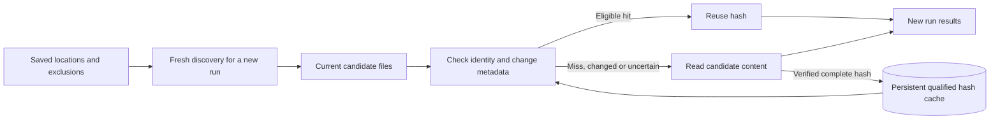

# Long scans and repeat scans

Accepted direction addition, 2026-09-08, from operator feedback. This specification extends S02/S05
and owns A08/A16/A17. It defines the experience and contract boundaries; it does not reopen the
completed scan optimization campaign or claim new native acceptance.

## Product promise

Scans may last hours or days. The user should be able to tell what is happening, inspect why work
is taking time, leave the progress view, and return without losing context. Repeat scans should
reuse expensive verified hash work while discovering the current contents of the selected locations.
The existing engine supports the core reuse mechanism; the redesign makes it understandable.

## Monitoring at three levels

| Level | Always available information | Interaction |
|---|---|---|
| Active strip throughout the app | Saved-scan name, active phase, elapsed time, warning count and View progress | Remains distinct from the historical run being reviewed; completion never steals focus |
| Main Scan view | Phase/activity, phase progress when measurable, current path, total elapsed time, qualified ETA, warnings, Cancel | Compact readable summary; current filename plus parent location; exact path selectable in details |
| Expandable Scan details | Candidate funnel, partial/full read rates and bytes, cache hits/misses/errors/stores, phase duration, folder substage counts, update freshness | Disclosure stays open while values update; tabs or subsections for Work, Hash reuse and Diagnostics |

Use a calm activity indicator and changing measured values. Keep the layout stable when a path or
large count changes. Paths are sampled current activity, not an exhaustive file log; concurrent
hashing means a single displayed path is representative. A persistent path can simply be a large
file still being read. Clear or relabel it as last reported activity when the phase changes or the
run stops. Never invent a per-file byte percentage: the current protocol has no per-file byte total.

## Honest progress and responsiveness

- Discovery: indeterminate activity with growing discovered file/byte counts; total work is unknown.
- Hash pipeline: use the worker's known candidate denominator and resolved logical work, with a
  label such as “Hash candidate work resolved”. Size filtering, partial screening and cache hits
  can resolve work without a full content read. Never label this percentage “disk bytes read”.
- Folder analysis: show Building hierarchy, Finding structural candidates, Verifying exact content,
  or Saving folder results, using the existing substage completed/total values. Each bar belongs to
  that substage; resetting at a named transition is expected. Unknown/zero totals use explicit text.
- Completion is a terminal event, not a bar reaching 100%. Do not average phases into a fabricated
  whole-scan percentage. ETA is for the measurable phase and retains the worker's availability and
  stability reasons. Do not extrapolate total completion from yesterday's scan.
- Elapsed time must remain readable beyond 24 hours, for example “2d 7h 14m”. Use a local clock for
  elapsed display, not fabricated worker progress. Track receipt time of the last accepted worker
  update separately; “Last update 38 seconds ago” is an observation, not proof of a hung engine.
- Keep no-progress, no-recent-update, unavailable metrics, worker-disconnected and failed states
  distinct. Do not infer worker health from an animation, stable filename or zero throughput. Only
  show failure when lifecycle/error evidence supports it; expose diagnostics and cancellation.
- Preserve latest-only/coalesced worker progress (at most ten ordinary updates per second), the
  existing five-second ordinary screen-reader announcement cadence, and prompt lifecycle/phase
  announcements. Do not queue every filename or steal focus. Honor reduced animation preferences.
- Cancelling acknowledges the request and waits for the worker's terminal result. Terminal views
  stop activity, label retained metrics historical, and provide Scan again / Open earlier results.
  Minimized/restored views render the latest accepted state without replaying intermediate frames.
- Closing the app is not a supported pause/resume mechanism. Preserve the existing shutdown
  contract; explain its effect before exit. A later run starts discovery again and may reuse hashes
  durably stored before cancellation/interruption; do not promise completion of an unfinished hash.

Technical detail remains useful rather than being removed for visual simplicity. Preserve the six
funnel counts, exact logical versus actual read bytes, rate-window labels, full/partial cache
outcomes, all folder substages, current warnings and the existing performance snapshot. CPU/memory/
device summaries stay in contextual Performance details. Unavailable device mapping remains explicit.
No raw sample history, new trend charts, per-file timing log or speculative “time saved” is required.

## Returning to the same locations

Offer **Scan again** for a saved scan. It opens its current setup and a concise locations/exclusions/
reuse summary; Start saves valid edits and starts a new dated run. The default remains **Reuse
verified hashes** with copy: “Checks these locations again. Reuses stored hashes when file identity
and change metadata qualify; new, changed or uncertain candidates are read as needed.”

Advanced exposes **Re-read candidate content**, mapped to `revalidate_content`. Explain that it
bypasses hash reuse but keeps normal candidate filtering; it does not force a full hash of every
discovered file. It can populate the cache for later runs. Record the chosen policy in run history.

| Filesystem change between runs | Required outcome and explanation |
|---|---|
| No changes, same cache available | Fresh discovery; qualified partial/full hashes can be reused. Enumeration, metadata checks and remaining analysis still take time |
| File added | Discovered in the new run; joins current candidate grouping. Hash only as required by normal filtering; never reuse by filename alone |
| File deleted | Absent from new-run membership. A remaining singleton ceases to be a duplicate; old historical findings are not rewritten |
| Content changed, including same size or preserved modified time | A changed identity/change signature cannot use the old hash. Uncertain evidence falls back conservatively; validate the Windows change-token case |
| Rename/move or file identity reused | Reuse only if the complete qualifying signature remains valid. Windows rename can change ChangeTime, so do not guarantee reuse after moves |
| Root unavailable or unreadable | Preserve setup validation and scan warning/failure semantics; never call an incomplete/unreadable location empty or claim all files were deleted |
| File changes/disappears during scanning | Existing change checks and warnings apply. A multi-day scan is not an atomic filesystem snapshot; review freshness remains separate |
| Cache unavailable, incompatible, pruned or entry ineligible | Fall back to content work and expose applicable warnings; no false hits, empty-result success or promise that all prior work survives indefinitely |
| App/worker restarted | Reopen the same configured cache store; a new run can reuse qualifying persisted entries. Existing historical run IDs and decisions retain their own context |

The cache accelerates content work; it is not a catalog of currently present files. Stale cache
entries for deleted files may remain until normal bounded eviction and must not resurrect results.
Do not purge/recreate the cache on Scan again, run selection, cancelled-run dismissal or app launch.
Result/status/cache/log stores retain their separate worker-owned responsibilities.

Show actual partial/full cache hit counts and content bytes read so the user can see reuse working.
Explain zero hits before qualifying lookups; do not call that failure. Do not sum partial/full hits
as unique files or translate hit percentage into wall-clock savings. Run-to-run added/deleted counts
or a content-diff view require a separate contract and remain outside this redesign.

## Source anchors and validation limits

The source baseline was inspected at `0827b28`; these are existing capabilities, not newly implemented:

- `crates/super-duper-core/src/engine.rs`: fresh `discover_files_with_exclusions`, configured cache
  path and cache-open fallback. `hasher/repeat_cache.rs`: persistent v3 store, qualifying signature,
  generation recovery and bounded retention. `platform/` supplies Windows change metadata.
- `hasher/xxhash.rs`: `qualified_repeat_cache_reuses_both_hash_stages_after_reopen_and_rejects_edits`
  covers cache reopen, both hash stages and content edit rejection. `repeat_cache.rs` has signature
  tests for preserved modified time and identity reuse. These tests were inspected, not rerun here.
- `tests/e2e_pipeline_tests.rs`: `test_rescan_after_deletion`, `test_idempotent_rescan`, and
  `files_changed_or_removed_after_discovery_become_warnings_not_false_results` are regression anchors.
  The deletion test truncates the result database before rescanning, so it does not prove retained
  history plus changed membership through the Windows worker. A17 must cover that combined workflow
  without truncating either result history or the cache. The idempotent test checks separate run IDs.
- `ScanProgressViewModel`, `ScanProgressProjection`, `WorkerContracts` and `PerformanceViewModel`
  already expose most monitoring values. Local receipt freshness and new presentation belong in
  Core/WPF, not a second scanner or a new UI-owned cache.

UIR-04 implements this experience; UIR-07 integrates retained diagnostics/history. UIR-08 validates
the combined new/changed/deleted/restart fixture and long-duration presentation. First inspect
existing tests, then add only missing cross-layer regressions. Do not rerun consumed physical campaigns.
